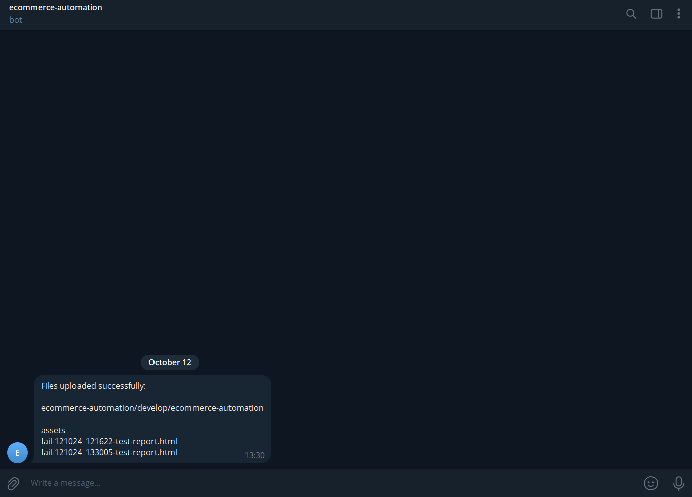
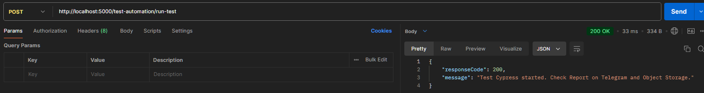
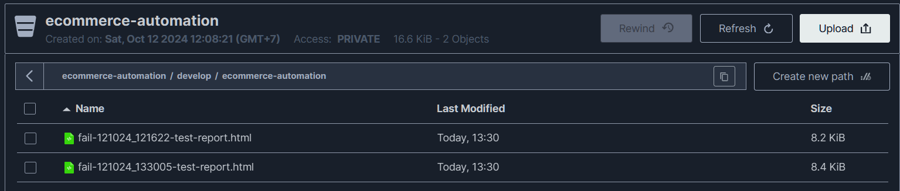

# ecommerce-automation
This repository is focused on automating ecommerce workflows using Cypress, a powerful end-to-end testing UI framework.

## Purpose
The main objective of this repository is to provide automated testing scripts for various ecommerce functionalities. This ensures that the ecommerce platform operates smoothly and any issues are identified and resolved quickly.

## Main Features
- **Automated Testing**: Uses Cypress to automate the testing of ecommerce functionalities such as product search, adding items to the cart, and checkout processes.
- **Headless Testing**: Supports running tests in headless mode for faster execution and integration into CI/CD pipelines.
- **Error Handling**: Includes mechanisms to handle uncaught exceptions during test execution.
- **Report**: Includes mechanisms to handle report after test execution in minio.
- **Notification**: Includes mechanisms to handle notification after test execution in telegram bot.
- **API**: Using API to execute automated test and can be further utilized for worker/cronjob usage.

## Screenshot Feature
- **Notification**

- **API**

- **Report**

 
## Prerequisites
- **Node.js**: Ensure Node.js is installed on your machine.
- **Cypress**: Install Cypress.
- **bot telegram**: Install Bot Telegram.
- **Minio**: Install Bot Telegram.

## Setup Instructions
1. Clone the repository:
   ```sh
   git clone https://github.com/acs-pwr/ecommerce-automation.git

2. Create .env in repository:
   ```sh
    PORT= {port}
    # minio
    BUCKET_NAME= ecommerce-automation
    STOREIO_DIRECTORY= develop/ecommerce-automation
    ACCESS_KEY_MINIO=Q3AM3UQ867SPQQA43P2F
    ACCESS_SECRET_MINIO=zuf+tfteSlswRu7BJ86wekitnifILbZam1KYY3TG
    URL_MINIO=play.min.io
    PORT_MINIO=9000
    #telegram-bot 
    BOT_TOKEN={token_telegram}
    CHAT_ID={chat_id_telegram}

